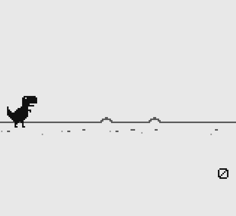
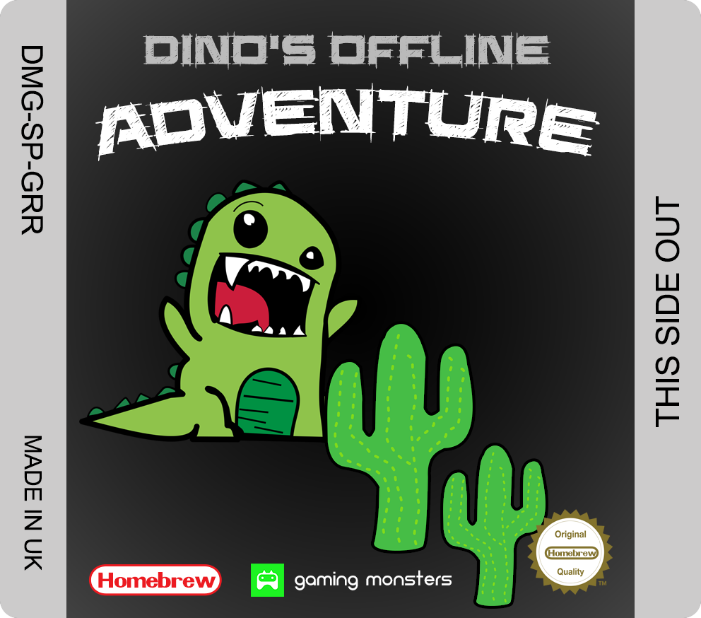

## Dino's Offline Adventure

### You heard it right a new Gameboy game in 2018!

**Dino's Offline Adventure** is a port of the modern classic built into Chrome the web browser.  

Built as our first Gameboy game and developed using the Gameboy Development Kit ([GBDK](http://gbdk.sourceforge.net/)) this simple game is even more of a challenge on the smaller Gameboy screen. Although you may learn a lot by reading the source code for this game it should be in no way considered a good practice example of writing 'c' or using GBDK this is our first project with both.

### How do I compile this myself?

First go to ([GBDK](http://gbdk.sourceforge.net/)) and follow the instructions there for installing it on your platform. Then open (in your favourite text edit, I recommend VisualStudio Code) and edit build.bat so that the path to GBDK 'c:\gbdk\bin\lcc' matches your setup. Once you have that done just run build.bat in your terminal/command prompt. If all works well the output of this will be dinosofflineadventure.gb being created in the project directory which you can then use in your emulator / flashcard of choice.

### Just want to play it?

If you just want to play the game then heac over to [https://gaming-monster.itch.io/dinos-offline-adventure](https://gaming-monster.itch.io/dinos-offline-adventure) to download or play it online.

### Can I buy it a physical cartridge?

We are starting to put together a **very limited run** of physical cartridges including a custom cartridge sticker. If you are interested please get in touch [gaming@gingemonster.com](mailto:gaming@gingemonster.com) and we will contact you as soon as we have everything ready. If you donate to download today we will include that against the future purchase price so no reason to delay.

### Feedback and comments
If you want to give us any feedback or comments please do so via [gaming@gingemonster.com](mailto:gaming@gingemonster.com) or twitter [https://twitter.com/gamingmonsteruk](https://twitter.com/gamingmonsteruk)

### Copyright, usage rights and credit

Obviously this game is inspired by the one built into the web browser Chrome however no game assets were copied from the original. Any clip art and fonts used to make the game were available free for commercial use without credit.

You are free to download and use this game and source code for free but you do not have the rights to re-distribute or sell this game in any way without explicit permission.